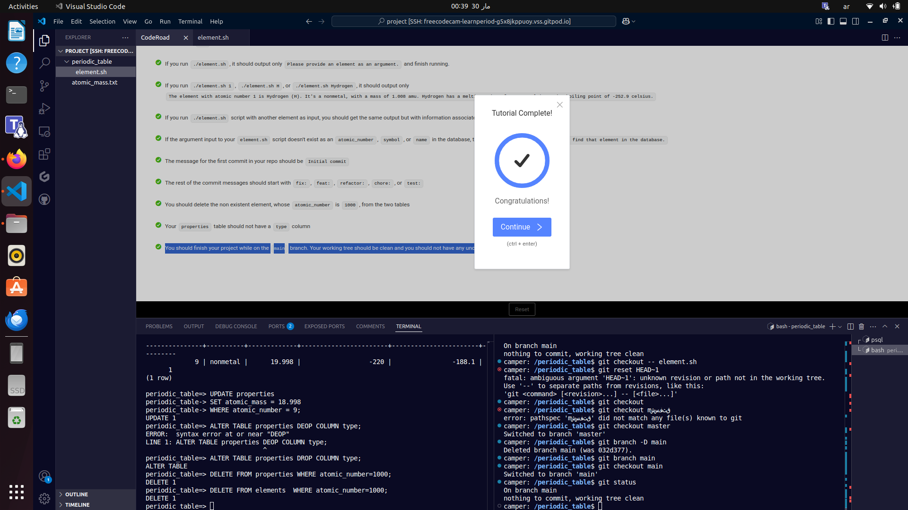
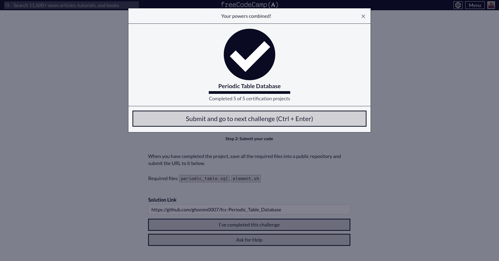

# **Periodic Table Database**  

This project is a **PostgreSQL database** that stores information about chemical elements. It allows users to query details such as atomic number, symbol, name, atomic mass, type, melting point, and boiling point. The database is designed to support efficient retrieval of periodic table data.  

---

## **How to Use**  

1. **Create the database** and restore its structure by running:  
   ```sh
   psql --username=freecodecamp --dbname=postgres -f periodic_table.sql
   ```  
2. **Run the interactive script** to query element details:  
   ```sh
   ./periodic_table.sh
   ```  

---

## **Completion Proof**  

Below is the image confirming the successful completion of this project:  

  
  

---

This project was completed as part of the **freeCodeCamp Relational Database Certification**. 🚀

